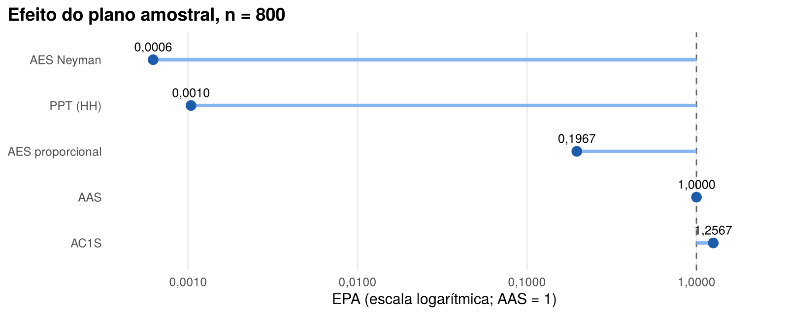

# Comparação teórica de planos amostrais: municípios brasileiros, Censo 2022

Qual plano amostral estima com mais precisão o total de domicílios com saneamento adequado no Brasil, a partir de uma amostra de 800 municípios? O projeto compara quatro planos (AAS, AES, conglomerados e PPT) calculando a variância teórica de cada um sobre um cadastro real de 5.570 municípios.

Trabalho da disciplina *Amostragem e Análise de Dados Amostrais* (PTE 3524) do mestrado da ENCE/IBGE.



**Resultado principal:** a amostragem estratificada por UF × porte, com alocação de Neyman, reduz a variância da AAS em mais de 99%. A PPT com domicílios como medida de tamanho fica muito próxima. A amostragem por conglomerados é pior que a AAS.

📄 **[Relatório completo](relatorio.md)**

---

## O que o projeto mostra

- **Desenho de planos sobre um cadastro real:** escolha da variável estratificadora pela decomposição da variância, alocação de Neyman com censo dos estratos que estouram, definição das UPAs e escolha da medida de tamanho da PPT pela dispersão das razões $y_i/x_i$.
- **Variâncias teóricas na notação de Silva, Bianchini e Dias (2024)**, todas **conferidas por simulação de Monte Carlo** ([`R/verificacao_monte_carlo.R`](R/verificacao_monte_carlo.R)).
- **Verificação do cadastro antes do uso.** Dois problemas foram identificados e documentados:
  - `domicilios` é a população dividida por um tamanho médio de domicílio fixo por macrorregião, e não um dado observado. Isso torna artificial qualquer PPT que combine domicílios e população.
  - as regiões imediatas e intermediárias não correspondem à divisão do IBGE (o Rio de Janeiro aparece na região de Nova Friburgo, por exemplo), o que muda a interpretação da amostragem por conglomerados.
- **Estratos por K-means avaliados contra estratos definidos a priori.** O K-means não os supera: o ganho aparente vem de recensear um grupo de municípios grandes, e agrupar por variáveis de escala apenas recorta faixas de população.

## Resultados

| Plano | CV | EPA |
|---|---:|---:|
| AAS (referência) | 21,61% | 1,0000 |
| AES UF × porte, proporcional | 9,58% | 0,1967 |
| **AES UF × porte, Neyman** | **0,54%** | **0,0006** |
| AC1S, regiões imediatas | 24,22% | 1,2567 |
| PPT com reposição (Hansen-Hurwitz) | 0,70% | 0,0010 |

*Proxy de $Y$: domicílios urbanos. $n = 800$ municípios.*

Os ganhos medem a eficiência para a proxy, que é função da escala e da urbanização municipais; com a variável de pesquisa verdadeira, os EPAs da AES e da PPT seriam maiores. A discussão completa está na §5 do relatório.

## Estrutura

```
├── relatorio.Rmd               # relatório (fonte)
├── relatorio.md                # relatório renderizado para o GitHub
├── R/
│   ├── planos.R                # variâncias teóricas: AAS, AES, AC1S, PPT
│   └── verificacao_monte_carlo.R
├── data/
│   └── Cadastro_Municipios_2026.csv
└── output/figuras/
```

## Como reproduzir

Em R ≥ 4.1, com os pacotes `rmarkdown`, `knitr`, `dplyr` e `ggplot2`, a partir da raiz do repositório:

```r
rmarkdown::render("relatorio.Rmd")      # gera relatorio.md e as figuras
source("R/verificacao_monte_carlo.R")   # confere as variâncias por simulação
```

## Dados

Cadastro de 5.570 municípios com variáveis do Censo Demográfico 2022 (IBGE, Tabela 9923 e correlatas), fornecido para a atividade. Detalhes e ressalvas em [`data/LEIAME.md`](data/LEIAME.md).

## Autor

**Alexandre Saldanha**, economista e mestrando em População, Território e Estatísticas Públicas (ENCE/IBGE).
[LinkedIn](https://www.linkedin.com/in/alexandre-saldanha-202a8592/) · [Lattes](http://lattes.cnpq.br/5148309722351266)

Código sob licença [MIT](LICENSE).
