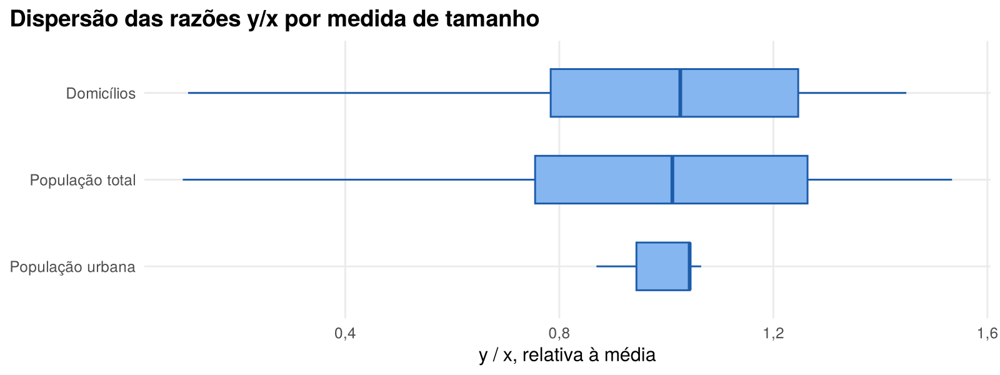

Comparação teórica de planos amostrais
================
Alexandre Saldanha
2026

- [§1. Contextualização](#1-contextualização)
- [§2. Exploração do cadastro](#2-exploração-do-cadastro)
  - [2.1 Verificação de consistência](#21-verificação-de-consistência)
  - [2.2 Distribuição da proxy](#22-distribuição-da-proxy)
  - [2.3 Estratos candidatos](#23-estratos-candidatos)
  - [2.4 UPAs candidatas](#24-upas-candidatas)
  - [2.5 Medida de tamanho para a PPT](#25-medida-de-tamanho-para-a-ppt)
- [§3. Planos amostrais e variâncias
  teóricas](#3-planos-amostrais-e-variâncias-teóricas)
  - [3.1 Amostragem aleatória simples sem reposição
    (AAS)](#31-amostragem-aleatória-simples-sem-reposição-aas)
  - [3.2 Amostragem estratificada simples
    (AES)](#32-amostragem-estratificada-simples-aes)
  - [3.3 Conglomerados em um estágio
    (AC1S)](#33-conglomerados-em-um-estágio-ac1s)
  - [3.4 Probabilidade proporcional ao tamanho com reposição
    (PPT)](#34-probabilidade-proporcional-ao-tamanho-com-reposição-ppt)
- [§4. Comparação dos planos](#4-comparação-dos-planos)
- [§5. Recomendação](#5-recomendação)
- [Extensão: estratos por K-means](#extensão-estratos-por-k-means)
- [Análise de sensibilidade: domicílios como
  proxy](#análise-de-sensibilidade-domicílios-como-proxy)
- [§6. Referências](#6-referências)
- [Apêndice: código](#apêndice-código)

# §1. Contextualização

**Pergunta de pesquisa (a):** qual o total de domicílios com acesso
adequado a saneamento básico no Brasil?

**Unidade.** O cadastro tem uma linha por município, e a variável de
pesquisa $Y_i$ é o total de domicílios com saneamento adequado *já
agregado* no município $i$. Como o plano não desce ao domicílio em um
segundo estágio, o domicílio é o objeto contado, e o **município é a
unidade de amostragem e de análise**.

- **População-alvo:** o conjunto dos municípios brasileiros, incluindo o
  Distrito Federal, existentes no território nacional na data de
  referência do Censo Demográfico 2022.
- **População de pesquisa:** os $N = 5.570$ municípios listados no
  cadastro `Cadastro_Municipios_2026`. A diferença entre as duas
  populações é de **cobertura** (municípios existentes *versus*
  municípios listados), e não de unidade.
- **Parâmetro:** o total populacional

$$Y = \sum_{i=1}^{N} Y_i ,$$

estimado com um tamanho amostral fixo de $n = 800$ municípios.

**Variável proxy: domicílios urbanos**, $y_i = d_i \, u_i$, em que $d_i$
é o número de domicílios (`domicilios`) e $u_i$ a proporção da população
em área urbana (`pct_urbana`). A rede geral de esgoto e de abastecimento
de água, que define o acesso adequado, concentra-se nas áreas urbanas; o
número de domicílios urbanos reproduz, portanto, a escala municipal *e*
a desigualdade de cobertura entre municípios mais e menos urbanizados. A
proxy supõe implicitamente cobertura total na área urbana e nula na
rural, o que superestima o nível de $Y$; como o objetivo é comparar
planos, o que importa é que a proxy reproduza a *distribuição* de $Y_i$
entre municípios. A escolha também evita a dependência quase
determinística com a medida de tamanho da PPT, discutida na §2.

# §2. Exploração do cadastro

## 2.1 Verificação de consistência

Antes de usar o cadastro, verificou-se a coerência interna das
variáveis. Dois resultados condicionam a análise:

1.  **`domicilios` é derivada da população.** Em todos os municípios,
    `domicilios` é a população total dividida por um tamanho médio de
    domicílio fixo por macrorregião (erro máximo de 4 domicílios). A
    variável não traz informação além de `pop_total_censo2022` e da
    região. Consequência: qualquer par proxy/medida de tamanho formado
    por essas duas variáveis tem razão $y_i/x_i$ praticamente constante.

| Região       | Pessoas por domicílio | Mínimo | Máximo |
|:-------------|----------------------:|-------:|-------:|
| Centro-Oeste |                  2,71 |  2,708 |  2,712 |
| Nordeste     |                  2,93 |  2,928 |  2,932 |
| Norte        |                  3,18 |  3,177 |  3,182 |
| Sudeste      |                  2,65 |  2,648 |  2,653 |
| Sul          |                  2,60 |  2,597 |  2,602 |

2.  **As regiões geográficas imediatas e intermediárias não correspondem
    à divisão do IBGE.** Capitais aparecem em regiões de outros
    municípios, por exemplo:

| Município      | UF  | Região imediata no cadastro |
|:---------------|:----|:----------------------------|
| Salvador       | BA  | Feira de Santana            |
| Belo Horizonte | MG  | Ipatinga                    |
| Rio de Janeiro | RJ  | Nova Friburgo               |
| Porto Alegre   | RS  | Santa Rosa                  |

A UF, a macrorregião, o porte e a tipologia são consistentes com a
população. As regiões são usadas como estão no cadastro, por ser o
cadastro da atividade, mas os resultados da AC1S devem ser lidos como
relativos a esses agrupamentos, que não são geográficos.

## 2.2 Distribuição da proxy

|     N |      Total |  Média | Mediana | Desvio-padrão |   CV |    Máximo |
|------:|-----------:|-------:|--------:|--------------:|-----:|----------:|
| 5.570 | 64.664.375 | 11.609 |   2.539 |        76.675 | 660% | 4.315.014 |

A distribuição é extremamente assimétrica: o CV populacional é de 660%,
a média é 4,6 vezes a mediana e os 41 municípios com mais de 500 mil
habitantes concentram 33% do total. Essa concentração explica a maior
parte dos resultados da §4.

## 2.3 Estratos candidatos

O critério de escolha é a decomposição da variância da proxy em parcelas
entre e dentro dos estratos: quanto maior a parcela **entre**, mais
homogêneos são os estratos internamente (Silva; Bianchini; Dias, 2024,
cap. 4).

| Estratificadora        |   H | N_h mínimo | N_h máximo | Variância entre | Variância dentro |
|:-----------------------|----:|-----------:|-----------:|----------------:|-----------------:|
| Região                 |   5 |        450 |      1.794 |            0,3% |            99,7% |
| UF                     |  27 |          1 |        853 |            4,4% |            95,6% |
| Tipologia urbano-rural |   5 |         90 |      2.039 |            4,9% |            95,1% |
| Porte populacional     |   7 |         41 |      1.367 |           36,9% |            63,1% |
| UF × porte             | 171 |          1 |        247 |           43,8% |            56,2% |

**UF × porte** (`estrato_uf_porte`) explica a maior parcela da variância
e combina dois domínios naturais de divulgação; é a estratificação
adotada. O porte isolado explica quase o mesmo, o que mostra que a
escala municipal é a principal fonte de heterogeneidade.

## 2.4 UPAs candidatas

| UPA                    |   M | M̄ (municípios por UPA) | Mínimo | Máximo | m (UPAs para n ≈ 800) | n esperado |
|:-----------------------|----:|-----------------------:|-------:|-------:|----------------------:|-----------:|
| Regiões imediatas      | 508 |                  10,96 |      1 |     47 |                    73 |        800 |
| Regiões intermediárias | 133 |                  41,88 |      1 |    146 |                    19 |        796 |

Os conglomerados são heterogêneos *entre si* em tamanho: os totais por
região imediata têm desvio-padrão de 284.706 domicílios urbanos, para
uma média de 127.292. A eficiência da AC1S depende justamente da
variância desses totais, que é alta porque as UPAs reúnem números
diferentes de municípios, de portes muito diferentes. As regiões
imediatas foram escolhidas por oferecerem mais UPAs (73 em vez de 19) e
conglomerados menores.

## 2.5 Medida de tamanho para a PPT

A medida de tamanho deve antecipar a magnitude de $y_i$ **sem ser a
própria proxy nem uma transformação direta dela**. O diagnóstico
relevante não é só a correlação, mas a dispersão das razões $y_i/x_i$:
quanto mais constante a razão, menor a variância da PPT, e uma razão
constante *por construção* torna a comparação artificial.

| Medida de tamanho | Correlação com y | CV de y/x | EPA da PPT |
|:------------------|-----------------:|----------:|-----------:|
| Domicílios        |            1,000 |     0,292 |    0,00104 |
| População total   |            0,999 |     0,313 |    0,00134 |
| População urbana  |            0,999 |     0,062 |    0,00009 |
| Área (km²)        |            0,010 |     5,657 |    2,33085 |

- **População urbana** é inadequada: $y_i/x_i$ é o inverso do tamanho
  médio do domicílio da região, quase constante (CV de 0,062), e o EPA
  resulta artificialmente próximo de zero.
- **Área** não antecipa a magnitude de $y_i$ e torna a PPT pior que a
  AAS.
- **Domicílios** é a escolha adotada: $y_i/x_i = u_i$, a proporção
  urbana, que varia genuinamente entre municípios (CV de 0,292). A
  população total produz razão equivalente, a menos do fator regional.

<!-- -->

# §3. Planos amostrais e variâncias teóricas

Em todos os planos, a variância é a **variância teórica** do estimador
do total, calculada sobre o cadastro completo com a proxy no lugar de
$Y_i$, para $n = 800$. As cinco variâncias foram conferidas por
simulação de Monte Carlo, com 20 mil amostras por plano (5 mil na AES):
as variâncias empíricas ficaram a menos de 1,5% das teóricas
([`R/verificacao_monte_carlo.R`](R/verificacao_monte_carlo.R)).

## 3.1 Amostragem aleatória simples sem reposição (AAS)

**Definição operacional:** seleção equiprovável de 800 municípios entre
os 5.570 do cadastro (fração amostral $f = n/N$ de 14,4%).

$$\hat{Y}_{AAS} = \frac{N}{n}\sum_{i \in s} y_i, \qquad
V(\hat{Y}_{AAS}) = N^2\left(1 - \frac{n}{N}\right)\frac{S_y^2}{n}, \qquad
S_y^2 = \frac{1}{N-1}\sum_{i=1}^{N}(y_i - \bar{Y})^2$$

**Resultado:** $V(\hat{Y}_{AAS}) =$ 1,95 × 10<sup>14</sup>, CV de
21,61%. É a referência do EPA.

## 3.2 Amostragem estratificada simples (AES)

**Definição operacional:** 171 estratos UF × porte; AAS independente
dentro de cada estrato.

$$\hat{Y}_{AES} = \sum_{h=1}^{H}\frac{N_h}{n_h}\sum_{i \in s_h} y_{hi}, \qquad
V(\hat{Y}_{AES}) = \sum_{h=1}^{H} N_h^2\left(1 - \frac{n_h}{N_h}\right)\frac{S_h^2}{n_h}$$

Foram calculadas duas alocações:

- **Proporcional:** $n_h \propto N_h$;
- **Neyman:** $n_h = n \, \dfrac{N_h S_h}{\sum_k N_k S_k}$, que minimiza
  $V(\hat{Y}_{AES})$ para $n$ fixo.

Em ambas, cada estrato recebe ao menos $\min(N_h, 2)$ unidades, para que
todos sejam cobertos e a variância seja estimável. Na alocação de
Neyman, quando $n_h > N_h$, o estrato é recenseado ($n_h = N_h$,
contribuição nula para a variância) e a amostra restante é realocada
entre os demais, repetindo até que nenhum estrato ultrapasse o seu
tamanho (Cochran, 1977, cap. 5). Essa regra resolve o “estouro” de
alocação nos estratos de municípios grandes sem precisar alterar a
estratificação.

| Alocação     | Estratos recenseados | Fração de y nos recenseados |    CV |    EPA |
|:-------------|---------------------:|----------------------------:|------:|-------:|
| Proporcional |                   34 |                       16,6% | 9,58% | 0,1967 |
| Neyman       |                   56 |                       63,0% | 0,54% | 0,0006 |

Na alocação de Neyman, 56 estratos são recenseados e concentram 63% de
$y$. Como a variância vem quase toda dos municípios grandes,
recenseá-los elimina a maior parte dela.

## 3.3 Conglomerados em um estágio (AC1S)

**Definição operacional:** UPAs = regiões imediatas do cadastro
($M = 508$, com $\bar{M} = N/M = 10,96$ municípios por UPA). Seleção de
$m = n/\bar{M} \approx 73$ UPAs por AAS e censo dos municípios de cada
UPA selecionada, com tamanho esperado de 800 municípios.

$$\hat{Y}_{AC1} = \frac{M}{m}\sum_{i \in s_I} Y_i, \qquad
V(\hat{Y}_{AC1}) = M^2\left(1 - \frac{m}{M}\right)\frac{S_{Y}^2}{m}, \qquad
S_{Y}^2 = \frac{1}{M-1}\sum_{i=1}^{M}\left(Y_i - \frac{Y}{M}\right)^2$$

em que $Y_i = \sum_{j \in U_i} y_{ij}$ é o total da proxy na UPA $i$.

**Resultado:** CV de 24,22% e EPA de 1,257. Com regiões intermediárias
($m = 19$), o EPA sobe para 1,747: menos UPAs, maiores e mais desiguais,
aumentam a variância dos totais.

## 3.4 Probabilidade proporcional ao tamanho com reposição (PPT)

**Definição operacional:** $n = 800$ seleções independentes, com
reposição, com probabilidade $p_i = x_i / X$, em que $x_i$ é o número de
domicílios do município e $X = \sum_i x_i$.

$$\hat{Y}_{HH} = \frac{1}{n}\sum_{k=1}^{n}\frac{y_k}{p_k}, \qquad
V(\hat{Y}_{HH}) = \frac{1}{n}\sum_{i=1}^{N} p_i\left(\frac{y_i}{p_i} - Y\right)^2$$

Como $y_i/p_i = X \, y_i/x_i = X \, u_i$, a variância é proporcional à
variância ponderada da taxa de urbanização: a PPT elimina a
heterogeneidade de **escala** e mantém apenas a de **composição**.

**Resultado:** CV de 0,70% e EPA de 0,00104.

# §4. Comparação dos planos

| Plano                               |              Variância | Erro-padrão |     CV |    EPA |
|:------------------------------------|-----------------------:|------------:|-------:|-------:|
| AAS (referência)                    | 1,95 × 10<sup>14</sup> |  13.973.134 | 21,61% | 1,0000 |
| AES UF × porte, proporcional        | 3,84 × 10<sup>13</sup> |   6.197.582 |  9,58% | 0,1967 |
| AES UF × porte, Neyman              | 1,21 × 10<sup>11</sup> |     348.294 |  0,54% | 0,0006 |
| AC1S, regiões imediatas             | 2,45 × 10<sup>14</sup> |  15.664.350 | 24,22% | 1,2567 |
| PPT com reposição, MOS = domicílios | 2,03 × 10<sup>11</sup> |     450.510 |  0,70% | 0,0010 |

<!-- -->

A ordem dos planos decorre de como cada um lida com a assimetria da
proxy (§2.2):

- **AES com Neyman** tem a menor variância. Os estratos UF × porte
  separam os municípios por escala, que é a principal fonte de
  heterogeneidade (43,8% da variância está entre estratos), e a alocação
  de Neyman recenseia os estratos de municípios grandes, que concentram
  a variância.
- **PPT** fica muito próxima. Ao selecionar com probabilidade
  proporcional aos domicílios, neutraliza a escala; resta a variação da
  taxa de urbanização entre municípios.
- **AES proporcional** ganha com a estratificação, mas aloca amostra de
  acordo com o número de municípios, e não com a variância: os estratos
  de municípios pequenos, numerosos e homogêneos recebem amostra demais.
- **AC1S** é pior que a AAS (EPA \> 1). Sob conglomerados, a variância
  depende da dispersão dos totais das UPAs, que é alta porque as UPAs
  reúnem de 1 a 47 municípios e algumas contêm municípios muito grandes.
  Como os totais variam mais entre UPAs do que os valores entre
  municípios, sortear 73 UPAs informa menos que sortear 800 municípios.

# §5. Recomendação

**Recomenda-se a AES por UF × porte com alocação de Neyman.** É o plano
de menor variância para $n = 800$, produz estimativas diretas por UF e
por porte, e não depende de uma medida de tamanho. A PPT com domicílios
como medida de tamanho é uma alternativa quase equivalente em precisão,
mas a seleção com reposição permite repetir municípios e não garante
cobertura por UF.

**Limitações.**

1.  **Proxy no lugar de $Y$.** Os EPAs medem a eficiência *para a
    proxy*. A proxy é uma função da população e da taxa de urbanização,
    que são justamente as variáveis usadas na estratificação (porte) e
    na medida de tamanho (domicílios). A variável verdadeira tem
    componentes não explicados pela escala (renda, política local de
    saneamento), de modo que as variâncias reais dentro dos estratos,
    $S_h^2$, e as razões $Y_i/x_i$ serão mais dispersas e os EPAs da AES
    e da PPT, maiores. A ordem entre os planos tende a se manter; a
    magnitude dos ganhos, não.
2.  **Alocação de Neyman otimizada para a proxy.** Uma alocação ótima
    para a proxy pode ser subótima para $Y$. A alocação proporcional,
    menos eficiente aqui, é mais robusta a erros em $S_h$.
3.  **Correlação intraclasse na AC1S.** O resultado da AC1S depende das
    UPAs do cadastro, que não correspondem às regiões do IBGE (§2.1).
    Com conglomerados geográficos reais, a correlação intraclasse
    $\rho_c$ seria provavelmente maior, o que reforçaria a desvantagem
    do plano.
4.  **Qualidade do cadastro.** `domicilios` é derivada da população; uma
    medida de tamanho observada de forma independente tornaria a PPT
    menos dependente de construção.

# Extensão: estratos por K-means

Uma alternativa aos estratos definidos a priori é construí-los por
agrupamento, com K-means. Essa estratégia é avaliada aqui contra os
estratos previstos no cadastro, nas mesmas condições (Neyman com piso e
censo iterativo, $n = 800$).

Agrupamento com $H = 5$ sobre as variáveis padronizadas, 25
inicializações por ajuste.

| Estratificação                           |   H | Variância entre | Estratos recenseados | Fração de y nos recenseados | EPA (Neyman) |
|:-----------------------------------------|----:|----------------:|---------------------:|----------------------------:|-------------:|
| UF × porte (a priori)                    | 171 |           43,8% |                   56 |                       63,0% |       0,0006 |
| Porte (a priori)                         |   7 |           36,9% |                    2 |                       63,9% |       0,0007 |
| K-means: escala, urbanização e densidade |   5 |           10,8% |                    1 |                       68,5% |       0,0039 |
| K-means: urbanização e densidade         |   5 |            6,0% |                    0 |                        0,0% |       0,0539 |
| K-means: população e domicílios          |   5 |           91,6% |                    3 |                       29,5% |       0,0137 |
| Tipologia urbano-rural (a priori)        |   5 |            4,9% |                    0 |                        0,0% |       0,0919 |

1.  **O K-means não supera os estratos a priori.** Com as variáveis de
    escala, o EPA é de 0,0039, contra 0,0006 de UF × porte. O resultado
    é estável: em 30 sementes diferentes, o EPA foi sempre 0,0039, com o
    mesmo agrupamento.

2.  **O ganho vem do censo, não do agrupamento.** Um único grupo de 472
    municípios grandes e urbanos concentra 68,5% de $y$ e é recenseado;
    os demais grupos explicam pouco da variância (a parcela entre grupos
    é de apenas 10,8%).

3.  **Sem a variável de escala, o ganho cai muito** (EPA de 0,0539). O
    desempenho do K-means depende de agrupar pela mesma dimensão de
    escala que gera a proxy, o que torna a comparação favorável por
    construção.

4.  **Agrupar por população e domicílios equivale a cortar faixas de
    população.** As duas variáveis são proporcionais entre si (§2.1), e
    `domicilios` é a base da proxy. O algoritmo apenas corta a escala:
    5.382 municípios de 833 a 162.159 habitantes; 158 municípios de
    156.491 a 650.877 habitantes; 24 municípios de 697.054 a 2.063.689
    habitantes; 5 municípios de 2.315.560 a 6.211.223 habitantes; 1
    município com 11.451.999 habitantes (São Paulo). É uma
    estratificação por porte com pontos de corte definidos pelos dados,
    construída a partir da variável que se quer estimar. Esses estratos
    têm a maior variância entre grupos da tabela (91,6%), e ainda assim
    um EPA 20 vezes maior que o do porte. A variância entre grupos é
    dominada pelos poucos municípios gigantes isolados; já a variância
    do estimador depende de $\sum_h N_h S_h$, e o estrato de 5.382
    municípios, que vão de 833 a 162.159 habitantes, continua muito
    heterogêneo e recebe quase toda a amostra. A decomposição da
    variância orienta a escolha entre estratificações candidatas, mas
    não substitui o cálculo da variância do plano.

O estouro da alocação de Neyman, motivação comum para buscar estratos
alternativos, resolve-se com o censo dos estratos que estouram (§3.2),
mantendo estratos interpretáveis e definidos a priori. A estratificação
por agrupamento tem lugar em problemas multivariados, com vários
domínios e restrições de precisão; um exemplo é o algoritmo genético de
Bethel-Chromy implementado no pacote `SamplingStrata`.

# Análise de sensibilidade: domicílios como proxy

Uma escolha aparentemente natural seria usar `domicilios` como proxy e a
população total como medida de tamanho da PPT. Como `domicilios` é a
população dividida por uma constante regional (§2.1), a razão $y_i/x_i$
é, a menos do arredondamento, o inverso do tamanho médio do domicílio da
macrorregião: um único valor por região.

| Proxy                        | Medida de tamanho | CV de y/x | EPA da PPT |
|:-----------------------------|:------------------|----------:|-----------:|
| Domicílios                   | População total   |     0,062 |    0,00013 |
| Domicílios urbanos (adotada) | Domicílios        |     0,292 |    0,00104 |

O EPA de 0,00013 dessa combinação decorre da relação algébrica entre as
duas variáveis, e não de eficiência do plano.

Com `domicilios` como proxy, a comparação de estratificações confirma o
resultado da extensão: o porte com Neyman e censo dos estratos que
estouram supera os estratos obtidos por K-means.

| Estratificação (proxy = domicílios) | EPA (Neyman) |
|:------------------------------------|-------------:|
| K-means: população e domicílios     |       0,0156 |
| Porte populacional                  |       0,0005 |
| UF × porte                          |       0,0006 |

# §6. Referências

COCHRAN, W. G. *Sampling Techniques*. 3. ed. New York: John Wiley &
Sons, 1977.

HANSEN, M. H.; HURWITZ, W. N. On the theory of sampling from finite
populations. *The Annals of Mathematical Statistics*, v. 14, n. 4,
p. 333–362, 1943.

IBGE. *Censo Demográfico 2022: população e domicílios – primeiros
resultados*. Rio de Janeiro: IBGE, 2023.

KISH, L. *Survey Sampling*. New York: John Wiley & Sons, 1965.

LOHR, S. L. *Sampling: Design and Analysis*. 3. ed. Boca Raton: CRC
Press, 2022.

SILVA, P. L. N.; BIANCHINI, Z. M.; DIAS, A. J. R. *Amostragem: teoria e
prática usando R*. 2024. Disponível em:
<https://amostragemcomr.github.io/livro/>.

# Apêndice: código

O código completo está em [`R/planos.R`](R/planos.R) (funções dos
planos) e neste relatório ([`relatorio.Rmd`](relatorio.Rmd)). Para
reproduzir: `rmarkdown::render("relatorio.Rmd")`.

``` r
# =============================================================================
# Variâncias teóricas dos planos amostrais para o estimador do total
# Notação de Silva, Bianchini e Dias (2024). Todas as funções recebem o
# cadastro completo e calculam a variância verdadeira (populacional) do
# estimador, usando a proxy y como se fosse a variável de pesquisa.
# =============================================================================

# Variância populacional com divisor N - 1 (S^2 do livro)
s2 <- function(x) if (length(x) > 1) var(x) else 0


# -----------------------------------------------------------------------------
# AAS sem reposição
#   V(Y_hat) = N^2 (1 - n/N) S_y^2 / n
# -----------------------------------------------------------------------------
var_aas <- function(y, n) {
  N <- length(y)
  N^2 * (1 - n / N) * s2(y) / n
}


# -----------------------------------------------------------------------------
# AES: alocação e variância
#   V(Y_hat) = sum_h N_h^2 (1 - n_h/N_h) S_h^2 / n_h
# -----------------------------------------------------------------------------

# Arredonda um vetor real para inteiros que somam `total` (maiores restos)
arredondar_soma <- function(x, total) {
  base <- floor(x)
  falta <- total - sum(base)
  if (falta > 0) {
    ordem <- order(x - base, decreasing = TRUE)
    base[ordem[seq_len(falta)]] <- base[ordem[seq_len(falta)]] + 1
  }
  base
}

# Alocação com piso de min(N_h, 2) unidades por estrato (necessário para que
# todos os estratos sejam cobertos e a variância seja estimável) e censo
# (take-all) iterativo quando a alocação ótima ultrapassa N_h.
#   metodo = "proporcional": n_h ∝ N_h
#   metodo = "neyman":       n_h ∝ N_h S_h
alocar <- function(Nh, Sh, n, metodo = c("neyman", "proporcional")) {
  metodo <- match.arg(metodo)
  piso <- pmin(Nh, 2)
  nh <- piso
  livre <- rep(TRUE, length(Nh))
  repeat {
    peso <- if (metodo == "neyman") Nh * Sh else Nh
    restante <- n - sum(nh[!livre]) - sum(piso[livre])
    w <- ifelse(livre, peso, 0)
    if (sum(w) == 0) break
    alvo <- piso + ifelse(livre, restante * w / sum(w), 0)
    alvo[!livre] <- Nh[!livre]
    estoura <- livre & alvo > Nh
    if (!any(estoura)) { nh <- alvo; break }
    livre[estoura] <- FALSE
    nh[estoura] <- Nh[estoura]
  }
  # arredondamento preservando a soma e os limites [piso, N_h]
  nh_int <- arredondar_soma(nh, n)
  pmin(pmax(nh_int, piso), Nh)
}

aes_plano <- function(y, estrato, n, metodo = "neyman") {
  tab <- data.frame(y = y, h = estrato) |>
    dplyr::group_by(h) |>
    dplyr::summarise(Nh = dplyr::n(), Yh = sum(y), Sh2 = s2(y), .groups = "drop")
  tab$nh <- alocar(tab$Nh, sqrt(tab$Sh2), n, metodo)
  tab$vh <- with(tab, ifelse(nh >= Nh, 0, Nh^2 * (1 - nh / Nh) * Sh2 / nh))
  list(estratos = tab, variancia = sum(tab$vh), n = sum(tab$nh),
       n_censo = sum(tab$nh >= tab$Nh), y_censo = sum(tab$Yh[tab$nh >= tab$Nh]))
}

# Decomposição da variância: proporção da soma de quadrados entre estratos
r2_entre <- function(y, grupo) {
  medias <- ave(y, grupo)
  sum((medias - mean(y))^2) / sum((y - mean(y))^2)
}


# -----------------------------------------------------------------------------
# Conglomerados em um estágio (AC1S): AAS de m UPAs, censo dentro delas
#   Y_hat = (M/m) sum_{i in s} Y_i
#   V(Y_hat) = M^2 (1 - m/M) S_{Y}^2 / m,  S_Y^2 = variância dos totais das UPAs
# -----------------------------------------------------------------------------
ac1s <- function(y, upa, n) {
  totais <- tapply(y, upa, sum)
  tamanhos <- tapply(y, upa, length)
  M <- length(totais)
  N <- length(y)
  Mbar <- N / M
  m <- round(n / Mbar)
  list(M = M, Mbar = Mbar, m = m, n_esperado = m * Mbar,
       min_Mi = min(tamanhos), max_Mi = max(tamanhos),
       S2_totais = s2(totais),
       variancia = M^2 * (1 - m / M) * s2(totais) / m)
}


# -----------------------------------------------------------------------------
# PPT com reposição, estimador de Hansen-Hurwitz
#   p_i = x_i / X,   Y_hat = (1/n) sum_{k=1}^{n} y_k / p_k
#   V(Y_hat) = (1/n) sum_{i=1}^{N} p_i (y_i / p_i - Y)^2
# -----------------------------------------------------------------------------
ppt_hh <- function(y, x, n) {
  p <- x / sum(x)
  Y <- sum(y)
  razao <- y / x
  list(variancia = sum(p * (y / p - Y)^2) / n,
       cor_yx = cor(y, x),
       cv_razao = sd(razao) / mean(razao),
       razao = razao)
}
```
